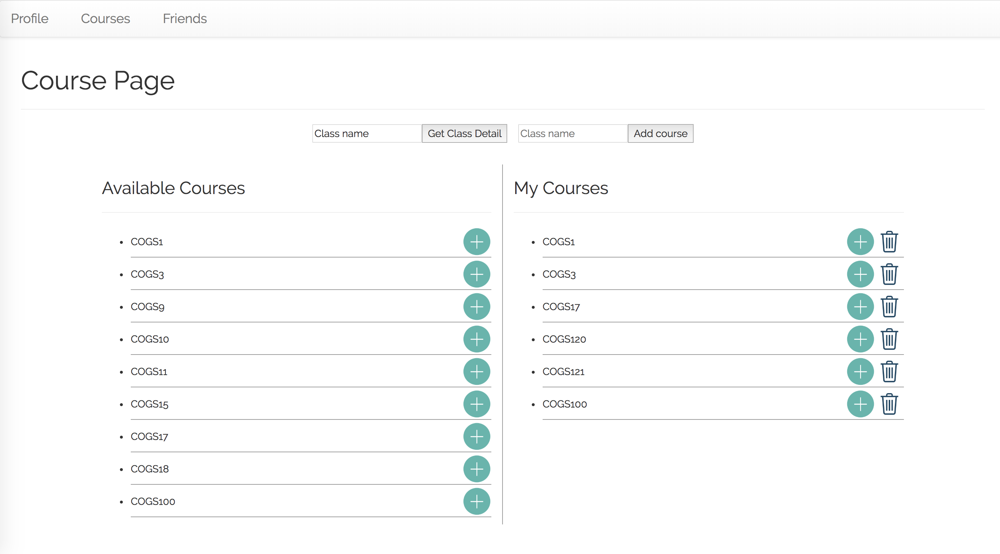
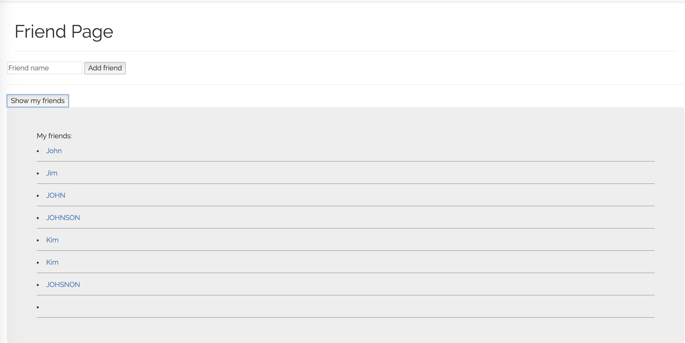
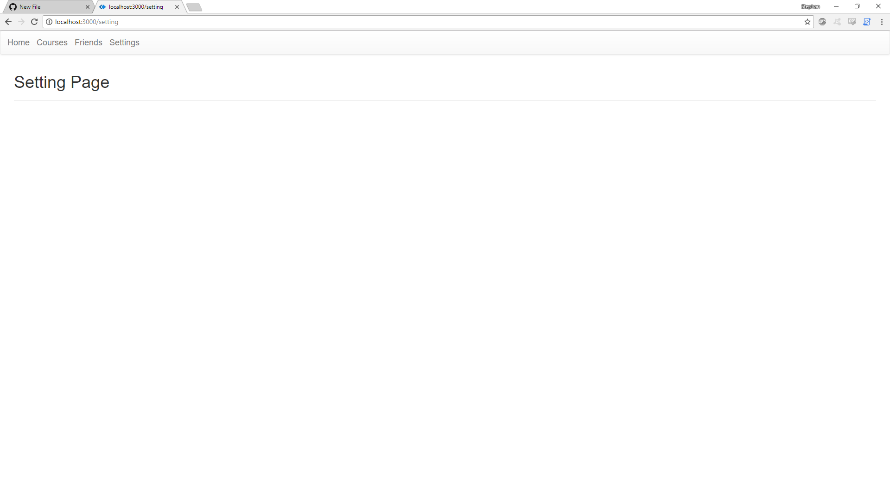

The major difference in UI compared to milestone 4 is the graph which visualizes the # of students attending various classes.
The first action users are able to do is to show all classes and then get the details on a specific class, such as COGS1.
The second action users are able to do is to add which class they plan to attend by using the details retrieved from step 1. For example: 
adding COGS1 with professor De Sa, Virginia, at 9:30a-10:50a.

Home Page:

Courses:

Friends:

Settings:

