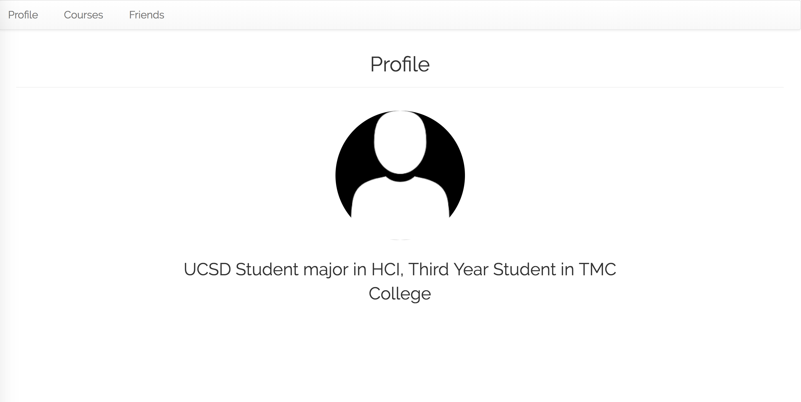
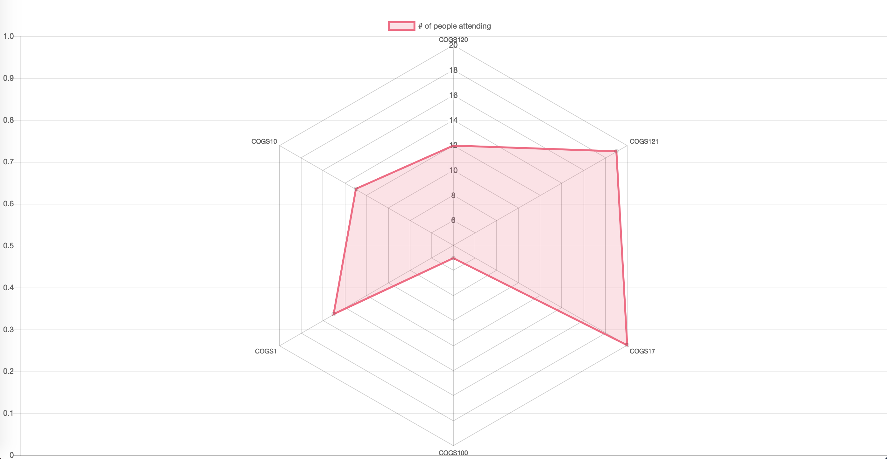

The app is nearly finished with the major change of the ui and graph in the interface:
First, the Courses are all being listed in the avaliable courses list and there 
we have the option to show the class detail rather than show all the classes. Also, 
We change the ui of my courses listed in the right hand side of the course page and 
we have the add and delete button in each row. Friends page is not so much changed becasue
we need to keep track of who will be shown in the graph below

Home Page:

Courses:

Friends:

Graphs:
