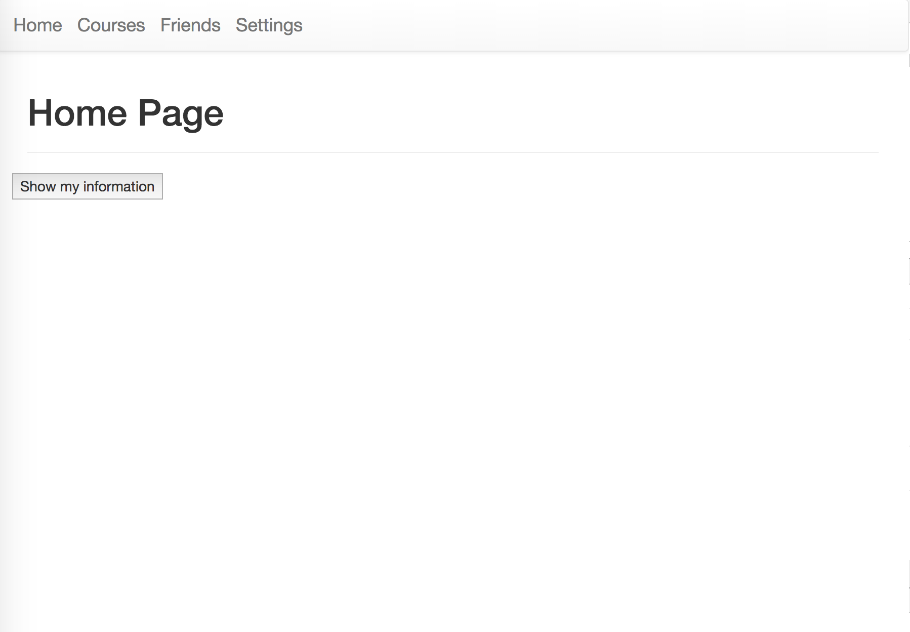
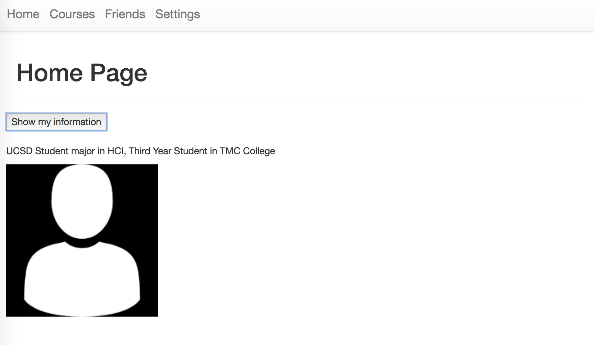
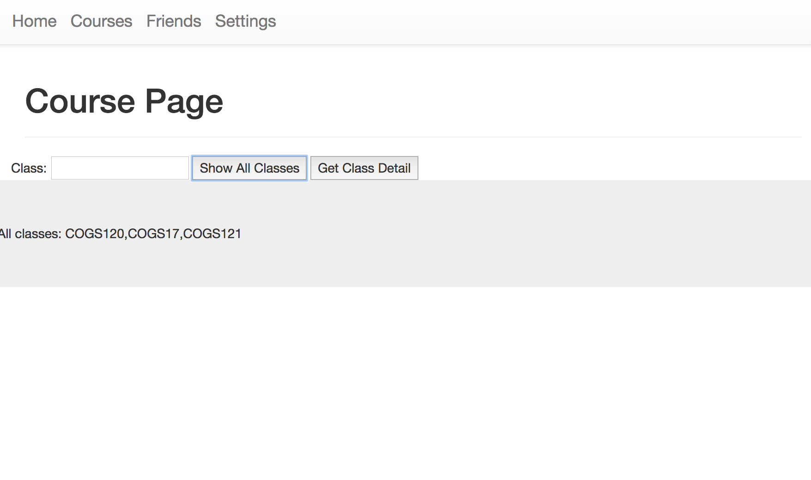

The screenshots for this week are entirely different from our prototypes from the previous week. Our team made the decision to pivot our idea to a class selection tool for UCSD students. Rather than having to have multiple tabs open when selecting classes we hope to make the process easier by suggesting classes for students based on degree requirements are already fulfilled vs. what courses they still need to take as well as allowing them to see what courses/sections friends are enrolled in. The home page currently shows your own profile information such as major, year, and college. The home page also has a nav bar allowing users to go to the courses page where they could see the current course offerings and details on classes.

Home Page

Course Page

